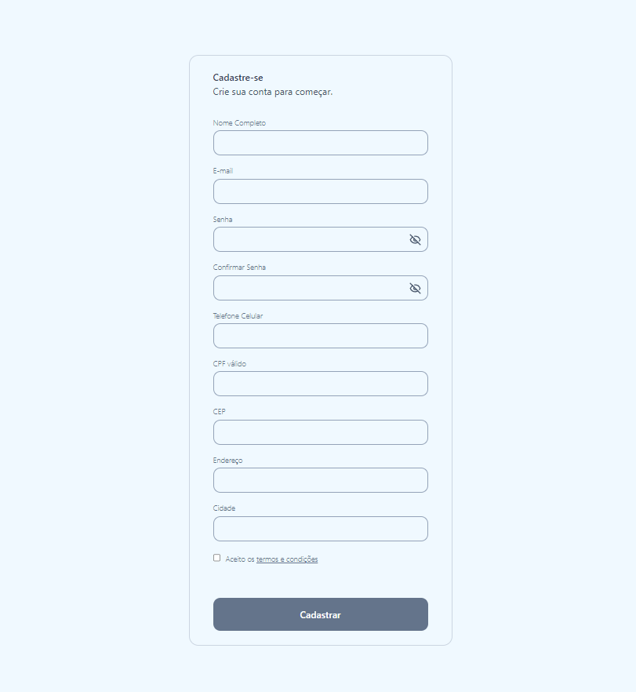

# Formulário dinâmico com React Hook Form e Zod

Um formulário com validação client-side e server-side, consumindo APIs de busca de CEP, CPF e de validação do próprio formulário.
 
> Durante o desenvolvimento do projeto, tive a oportunidade de aprender e praticar as seguintes tecnologias:
> Vite: Configuração rápida e eficiente para projetos modernos de frontend.  
> Zod: Validação de dados e segurança em formulários com TypeScript.  
> React Hook Form: Gerenciamento de formulários de maneira performática e simplificada.  
> Consumo de APIs: Integração com serviços externos e manipulação de dados.  
> Tailwind CSS: Estilização utilizando classes utilitárias para um design responsivo e moderno.  

Você pode acessar o formulário [clicando neste link.](https://help.github.com/en/github/collaborating-with-issues-and-pull-requests/creating-a-pull-request).

## 📫 Deseja contribuir?

Para contribuir com o projeto, siga estas etapas:

1. Bifurque este repositório.
2. Crie um branch: `git checkout -b <nome_branch>`.
3. Faça suas alterações e confirme-as: `git commit -m '<mensagem_commit>'`
4. Envie para o branch original: `git push origin formulario-react-hook-form-e-zod / <local>`
5. Crie a solicitação de pull.

Como alternativa, consulte a documentação do GitHub em [como criar uma solicitação pull](https://help.github.com/en/github/collaborating-with-issues-and-pull-requests/creating-a-pull-request).

## 📝 Licença

Esse projeto está sob licença. Veja o arquivo [LICENÇA](LICENSE.md) para mais detalhes.
